# Obstacle-Aware Quadrotor Control via Nonlinear MPC

A quaternion **Nonlinear Model Predictive Control (NMPC)** framework for quadrotor
**obstacle avoidance** and **aggressive maneuvers**, built on acados SQP-RTI and
evaluated in Gazebo.

<p align="center">
  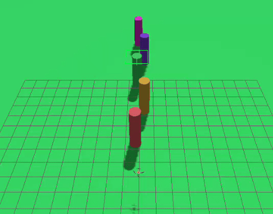
  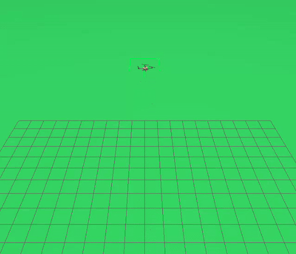
</p>

The project asks a concrete question:

> **Where should obstacle avoidance live** — as a formal keep-out constraint
> *inside* the NMPC, or in a separate Artificial Potential Field (APF) planner
> whose collision-free references the NMPC merely tracks?

Both are implemented on the *same* controller and the *same* lidar perception,
then compared head-to-head at a matched obstacle clearance, so only the
architecture differs.

---

## Highlights

- **Quaternion NMPC** (13-state, acados SQP-RTI + HPIPM, 1 s horizon, 20 Hz) — singularity-free attitude.
- **In-MPC keep-out constraint** vs **APF-reference tracking** — a controlled comparison at matched clearance.
- **Lidar + DBSCAN perception** feeding a reactive APF horizon — no pre-planned waypoints.
- **Backflip** with a feedforward Lupashin profile and **genuine NMPC recovery**.
- Real-time: average solve time **8.6 ms**, well within the 50 ms budget.

---

## Obstacle Avoidance: In-MPC vs APF

On an in-line slalom (five obstacles on the start–goal line) at a matched
**≈0.9 m** clearance, avoidance computed *inside* the NMPC is reliable up to
**1.5 m/s**, while the APF-reference tracker reaches **2.2 m/s**. A wide-clearance
APF goes further (**2.81 m/s**) — but the advantage comes from its **wider
look-ahead**, not the architecture: tighten the APF to the same clearance and the
gap nearly vanishes.

<p align="center">
  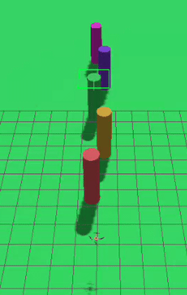
  
  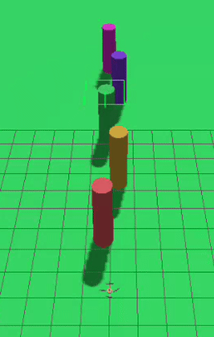
</p>

<p align="center">
  <em>Left to right: in-MPC keep-out (1.5 m/s), APF-reference tracking (3.0 m/s),
  wide APF.</em>
</p>

<p align="center">
  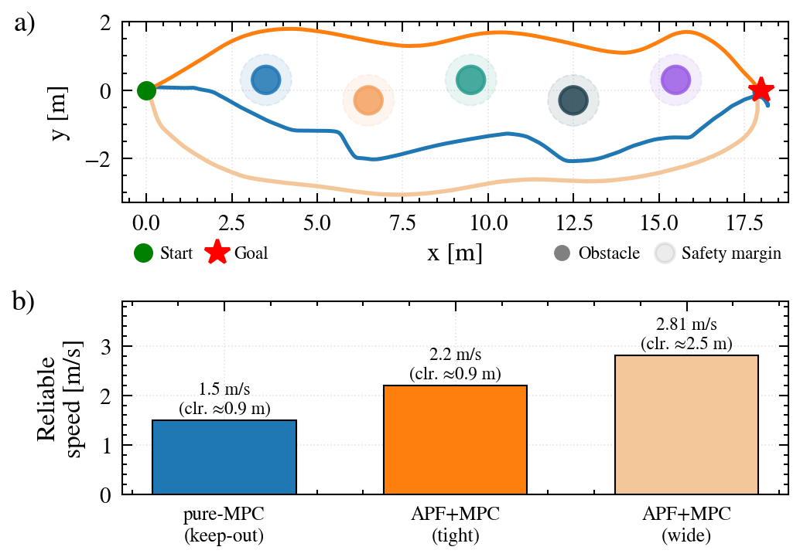
</p>

> **(a)** Paths for the three configurations. **(b)** Maximum reliable speed.
> The wide planner keeps more room and turns earlier; at matched clearance the
> two architectures are close.

**Run it** — Terminal 1 (in-line slalom world):

```bash
bash simulation_obstacles.sh worlds/quad_obstacles_line.world
```

Terminal 2:

```python
>>> setup(perception_level=2)                              # lidar + DBSCAN
>>> slalom_mpc_avoid(max_vel=1.5)                          # in-MPC keep-out (pure-MPC)
>>> slalom_reactive(use_perception=True, max_vel=2.2,
...                  apf_d0=0.3, apf_R_drone=0.20)         # APF tight (matched clearance)
>>> slalom_reactive(use_perception=True, max_vel=2.8)      # APF wide
```

### Shared failure mode

Above each mode's limit, every configuration fails the *same* way: the avoidance
tilt grows until the thrust axis points sideways, the vehicle accelerates
horizontally instead of supporting itself, and an **attitude runaway** collapses
the flight. The limit is set by the vehicle dynamics, not the solver.

<p align="center">
  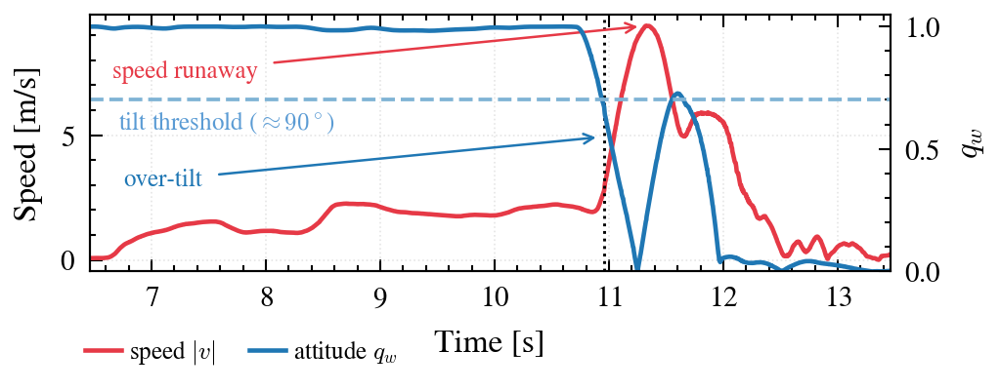
</p>

### Pure-MPC flight

With a goal-only reference plus the keep-out constraint, the lateral motion is
produced *entirely* by the controller — clearance to every obstacle stays above
the drone radius while thrust and torque remain within bounds.

<p align="center">
  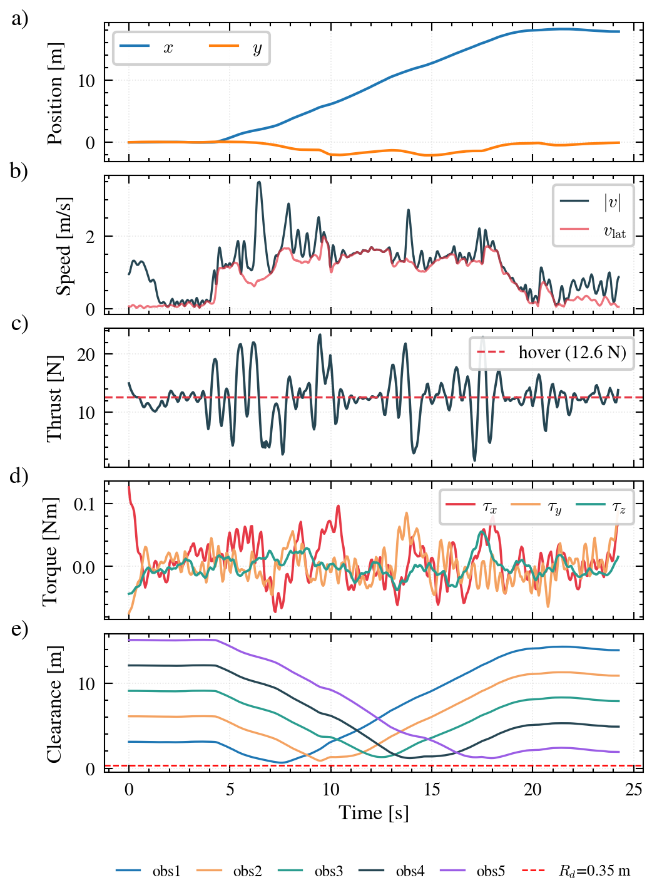
</p>

### Reactive APF in a dense slalom

In APF-reference mode the planner reacts online to a denser, alternating-obstacle
course: the potential field is evaluated at the current position each step and
integrated forward to build the NMPC reference, so the drone weaves through
without any pre-planned path.

<p align="center">
  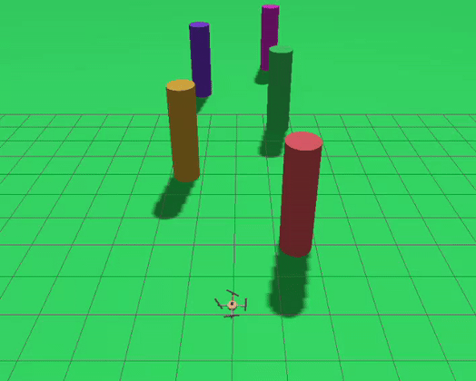
  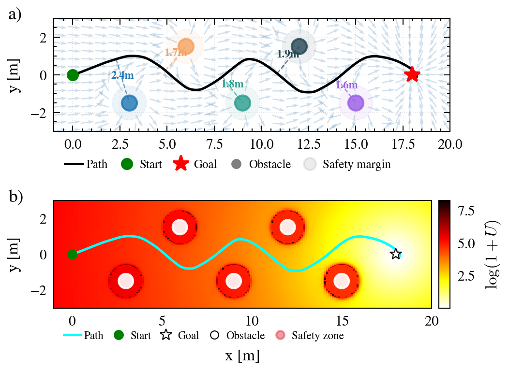
</p>

**Run it** — Terminal 1 (dense slalom world):

```bash
bash simulation_obstacles.sh worlds/quad_obstacles_dense.world
```

Terminal 2:

```python
>>> setup(perception_level=2)
>>> slalom_reactive(use_perception=True, max_vel=2.5)
```

---

## Backflip

A full 360° backflip uses a feedforward bang-coast-bang torque profile
(open-loop, since the rotation is longer than the 1 s horizon), and the **NMPC
handles the recovery**: a brief rate-kill brings the body rates into the solver's
basin, then the NMPC stabilises the attitude, arrests the drift and returns the
vehicle to the hover point.

<p align="center">
  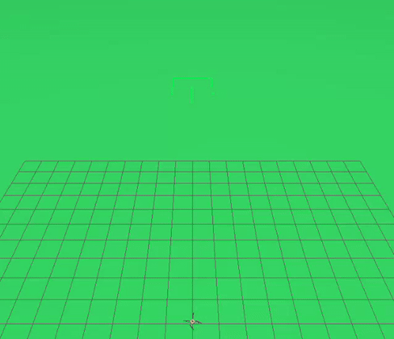
  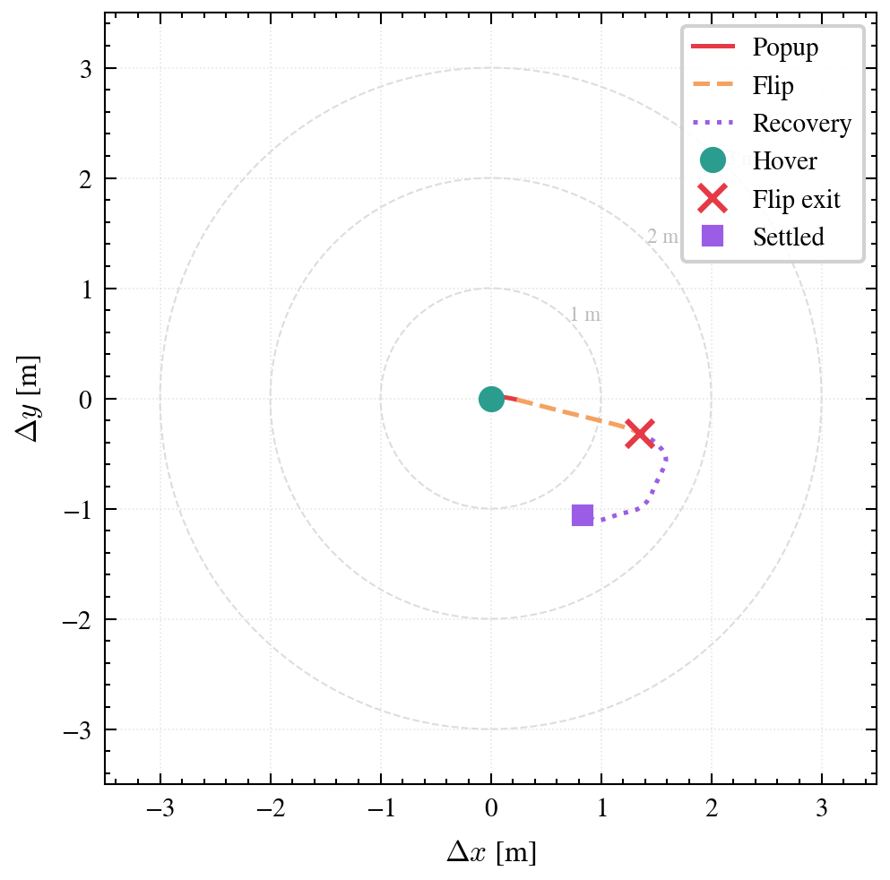
</p>

<p align="center">
  <em>Left: the maneuver. Right: top view of the flip-and-recover trajectory —
  pushed laterally during the open-loop rotation, then pulled back to hover by
  the NMPC.</em>
</p>

<table align="center">
<tr>
<td align="center">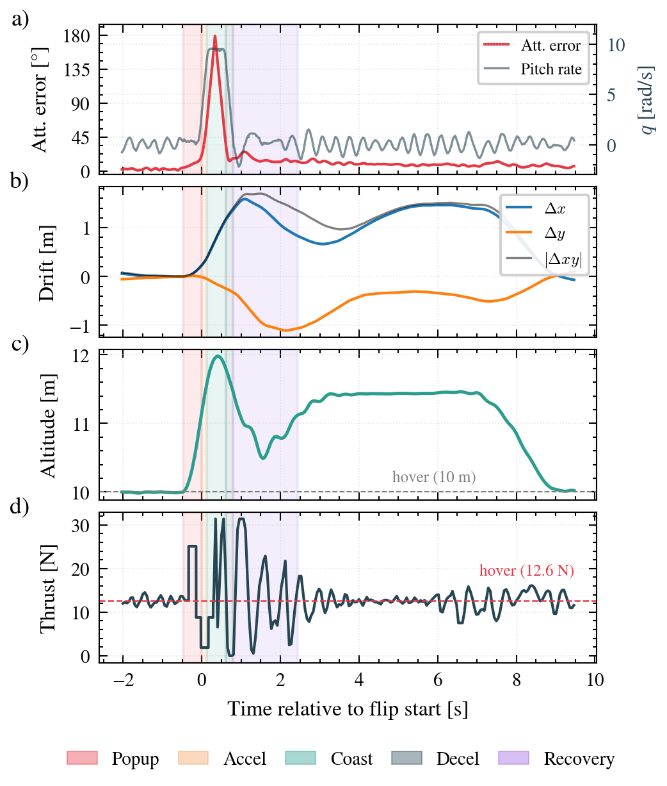</td>
<td>
<table>
<tr><th align="left">Metric</th><th align="left">Value</th></tr>
<tr><td>Flip duration</td><td>~0.73 s</td></tr>
<tr><td>Peak pitch rate</td><td>~9.5 rad/s</td></tr>
<tr><td>Peak lateral drift</td><td>~1.7 m</td></tr>
<tr><td>Landing error</td><td>~0.1 m</td></tr>
<tr><td>Recovery</td><td>NMPC (closed-loop)</td></tr>
</table>
</td>
</tr>
</table>

**Run it** — Terminal 1 (empty world, needs altitude clearance):

```bash
bash simulation.sh
```

Terminal 2:

```python
>>> setup()
>>> backflip_mpc_recovery()   # feedforward flip + NMPC recovery (paper version)
```

---

## Real-Time Performance

Every optimal control problem must solve within the 50 ms sampling period for the
receding-horizon loop to run online. It comfortably does.

<table align="center">
<tr>
<td align="center"></td>
<td>
<table>
<tr><th></th><th>Slalom</th><th>Backflip</th></tr>
<tr><td>Mean solve time</td><td>8.6 ms</td><td>8.2 ms</td></tr>
<tr><td>Max</td><td>21.4 ms</td><td>15.0 ms</td></tr>
<tr><td>Within 50 ms</td><td>100%</td><td>100%</td></tr>
</table>
</td>
</tr>
</table>

---

## How It Works

| Component | Summary |
| --- | --- |
| **Model** | 13-state rigid body `[p, v, q, ω]`, quaternion attitude, ERK4 integration |
| **NMPC** | acados SQP-RTI, HPIPM QP, N=20, Ts=50 ms, Gauss–Newton Hessian |
| **Keep-out** | soft constraint `‖p − p_obs‖² − (r + R_d)² ≥ 0` per obstacle, online lidar parameters |
| **APF** | attractive + repulsive field, reactive horizon builder feeding per-step references |
| **Perception** | 2-D lidar → DBSCAN clustering → bounding-circle obstacles, 20 Hz |
| **Backflip** | Lupashin 5-phase feedforward + open-loop rate-kill + NMPC recovery |

---

## System Requirements

| Requirement | Version |
| --- | --- |
| Docker Engine | ≥ 24 |
| Python | ≥ 3.10 |
| acados | ≥ 0.3 |
| CasADi | ≥ 3.6 |
| NumPy | ≥ 1.24 |
| Gazebo | Ionic (tk3lab Docker image) |
| GenoM3 | pocolibs middleware |

Docker image: `art/tk3lab:ionic-0.2`

---

## Installation

### 1. Clone the repository

```bash
git clone <repo-url> mpc-quadrotor
cd mpc-quadrotor
```

### 2. Start the Docker environment (tk3lab)

The project runs inside the tk3lab Docker container. The host `~/tk3lab-ws/` maps to `/shared-workspace/` inside Docker.

### 3. Install Dependencies (first time only)

Dependencies are installed to `/shared-workspace/` so they persist across Docker restarts.

```bash
cd /shared-workspace/src/mpc-quadrotor
bash setup_deps.sh install
```

This installs CasADi, NumPy, and acados into `/shared-workspace/pip-packages/` and `/shared-workspace/acados/`.

### 4. Environment Setup (after each Docker restart)

Run this once per Docker session, before using the MPC project:

```bash
source /shared-workspace/src/mpc-quadrotor/env_setup.sh
```

---

## Quick Start

The stack runs in two terminals (inside the tk3lab container).

**Terminal 1 — simulation:**

```bash
cd ~/tk3lab-ws/src/mpc-quadrotor
bash simulation_obstacles.sh worlds/quad_obstacles_line.world    # in-line slalom
# bash simulation_obstacles.sh worlds/quad_obstacles_dense.world # dense slalom
# bash simulation.sh                                             # empty world (backflips)
```

**Terminal 2 — Python control client:**

```bash
python3 -i quadrotor_mpc_client_v3.py
```
```python
>>> setup(perception_level=2)   # lidar + DBSCAN perception
```

Then call any demo from the sections below. See the report PDF for the full API
and parameter tables.

---

## Report

The full write-up is in **[`Obstacle_Aware_Quadrotor_NMPC.pdf`](Obstacle_Aware_Quadrotor_NMPC.pdf)**.

**Authors:** Gizem Doğa Filiz, İsmail Cem Yılmaz, Ivano Bazzo.

Key reference: S. Lupashin *et al.*, "A simple learning strategy for high-speed
quadrocopter multi-flips," *ICRA*, 2010.
