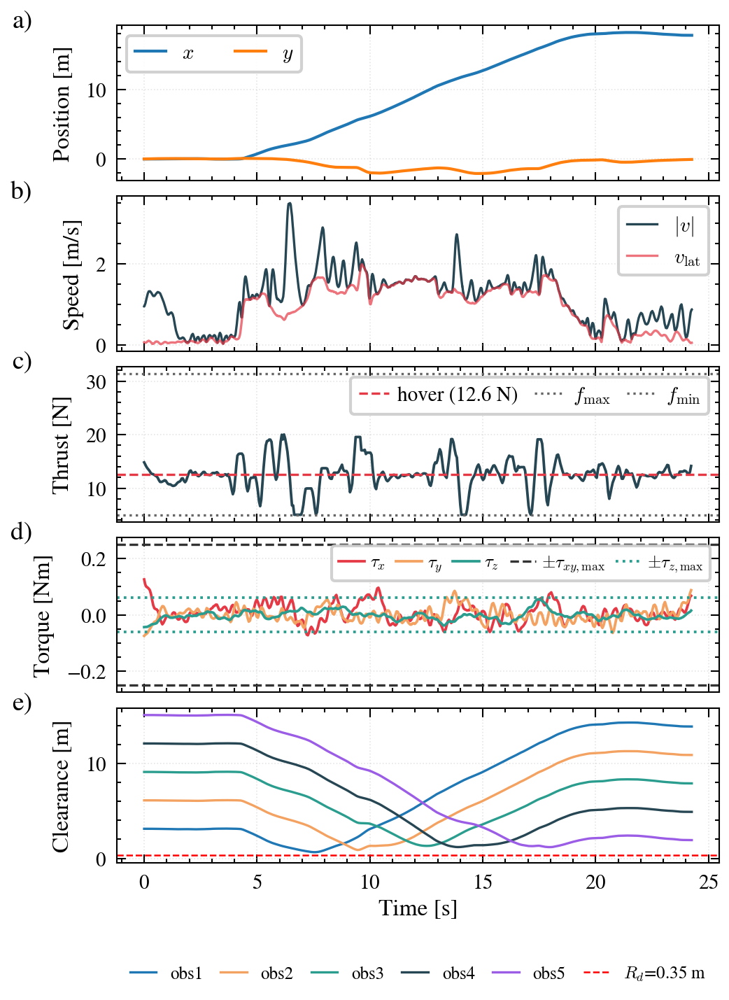
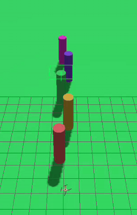
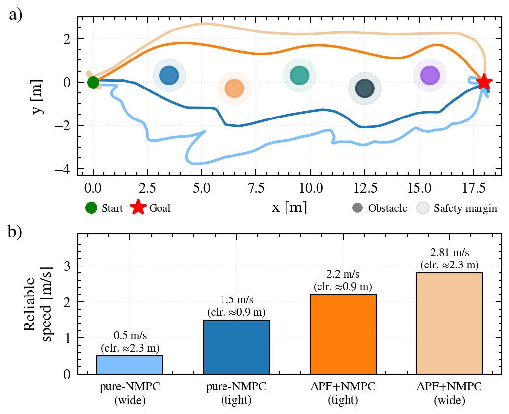
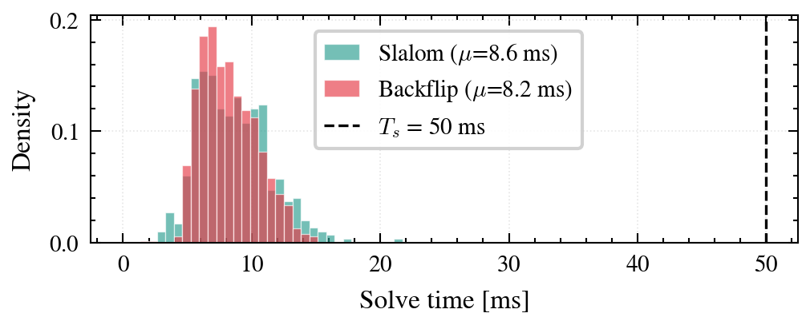

# 2026b-yilmaz_filiz

## Project information

**Project title:** Obstacle-Aware Quadrotor Control via Nonlinear MPC and Artificial Potential Fields

**Project description:**

A quaternion-based Nonlinear Model Predictive Control (NMPC) framework for
quadrotor obstacle avoidance. The controller uses a 13-dimensional
rigid-body state with quaternion attitude, avoiding Euler-angle
singularities near the tilt threshold at which both architectures fail,
and is solved online with an acados SQP-RTI solver at a 1 s horizon and
50 ms sampling rate. Obstacle avoidance is studied in two configurations:
as formal collision-avoidance constraints inside the NMPC optimal control
problem, and via a separate Artificial Potential Field (APF) planner
that generates references the NMPC tracks. Obstacles are detected online
from a 2-D lidar via DBSCAN clustering. A feedforward backflip maneuver
with NMPC-based post-flip recovery is additionally provided as a code
feature (not part of the report study).

**Team composition:**

| Name | Surname | University Email | Matricola |
|--------|--------|--------|--------|
| Gizem Doğa | Filiz | gizemdoga.filiz@mail.polimi.it | 304864 |
| İsmail Cem | Yılmaz | ismailcem.yilmaz@mail.polimi.it | 300436 |


***

# Quadrotor NMPC: Obstacle-Aware Local Planner

An **acados SQP-RTI** based Nonlinear Model Predictive Control (NMPC)
framework for quadrotor autonomous flight in Gazebo.

**Features**

* Quaternion-based NMPC 
* 1.0 s prediction horizon (N=20, Ts=50 ms), SQP-RTI single iteration per step
* Landing cone soft constraint `vz + α·z ≥ 0` (prevents hard landings)
* Per-rotor feasibility enforced exactly at every stage (`Ω² = B⁻¹u ≥ 0`)
* Offline APF path planning: pre-plans full path, fits quintic polynomials, NMPC tracks
* Reactive APF: online horizon builder at every NMPC step (no pre-planned waypoints)
* In-NMPC soft keep-out constraints: obstacle avoidance embedded directly in the OCP
* 2-D lidar + DBSCAN online perception
* Feedforward Lupashin backflip with NMPC-based post-flip recovery

**Politecnico di Milano, Aerial Robotics 2025-26**

The project asks a concrete question:

> **Where should obstacle avoidance live?** As a formal keep-out constraint
> *inside* the NMPC, or in a separate Artificial Potential Field (APF)
> planner whose collision-free references the NMPC merely tracks?

Both are implemented on the *same* controller and the *same* lidar
perception, then compared head-to-head on an in-line slalom at a matched
obstacle clearance, so only the architecture differs.

***

## Table of Contents

* [Overview](#overview)
* [Mathematical Formulation](#mathematical-formulation)
* [Architecture](#architecture)
* [System Requirements](#system-requirements)
* [Installation](#installation)
* [Testing and Usage](#testing-and-usage)
* [Results Summary](#results-summary)
* [Real-Time Performance](#real-time-performance)
* [Troubleshooting](#troubleshooting)
* [Project Structure](#project-structure)
* [Report](#report)
* [References](#references)

***

## Overview

The controller is a single quaternion-state NMPC with two interchangeable
obstacle-avoidance modes and a shared lidar perception front-end.

**NMPC only (in-NMPC keep-out).**
The NMPC receives a straight goal-directed reference (no obstacle in the
reference), and a soft *keep-out* constraint per obstacle is added at
every stage of the horizon. Avoidance is produced entirely by the
controller: the lateral motion appears when the predicted trajectory
reaches the keep-out boundary. Reliable for tight clearances at moderate
speeds.

**NMPC with APF reference (APF plans, NMPC tracks).**
An Artificial Potential Field is evaluated at the drone's current
position at every control step, and its resultant force is integrated
forward `N+1` steps to build the NMPC reference horizon. Avoidance is
produced by the reference: the reference already curves away from an
obstacle while it is still far, and the NMPC tracks that smoother
reference with error. The wider the APF influence distance, the earlier
the reference curves, and the higher the reliable cruise speed.

Both modes use the same physics, same lidar+DBSCAN perception, and same
solver. A comparison at a matched obstacle clearance is the main
experimental study reported in the report.

The code additionally implements two extras that are not part of the
report study:

* **Reactive vs offline APF.** In addition to the reactive mode used
  in the report, an offline mode pre-plans the full path with APF, fits
  quintic polynomials through the resulting waypoints, and hands a fixed
  trajectory to the NMPC to track.
* **Backflip.** A feedforward Lupashin bang-coast-bang torque profile
  executes an open-loop 360° flip (longer than the 1 s horizon), and the
  NMPC handles the post-flip recovery.

## Mathematical Formulation

Full derivation is in the report (see [Report](#report)); the essentials
are collected here for orientation.

**State and input.** The 13-dimensional rigid-body state and 4-dimensional
generalised-wrench input:

```
State  x ∈ R^13 :  [px, py, pz,  vx, vy, vz,  qw, qx, qy, qz,  p, q, r]
Input  u ∈ R^4  :  [f_total, τx, τy, τz]
```

**Optimal control problem.** At every sampling instant the NMPC solves

```
min   Σ_k ‖[x_k; u_k] − [x_ref_k; u_hov]‖²_W  +  ‖x_N − x_ref_N‖²_{W_N}
 x,u

s.t.  x_{k+1} = F(x_k, u_k)                   (dynamics, ERK4)
      x_0     = x_hat(t_k)                    (current state)
      u_k     ∈ U                             (actuator box)
      Ω²_k    = B⁻¹ u_k ≥ 0                   (per-rotor feasibility, hard)
      v_{z,k} + α p_{z,k} ≥ 0                 (landing cone, soft)
      ‖p_k − p_{obs,i}‖² − (r_i + R_d)² ≥ 0   (obstacle keep-out, soft)
```

with `U` = `[f_min, f_max] × [-τxy_max, τxy_max]² × [-τz_max, τz_max]`,
Gauss-Newton Hessian, HPIPM QP with partial condensing, and one SQP
iteration per 50 ms sampling period.

**Cost weights.** A nonlinear least-squares cost on the concatenated
state and wrench, with a component-wise quaternion penalty and an
antipodal sign fix `q ← -q` when `qw · qw_ref < 0`. Numerical values
are in the report (Table I).

**APF reference.** For obstacle-avoidance mode with an APF reference,
attractive and repulsive potentials give a total force

```
F_att = k_att · (p_goal − p)
F_rep = k_rep · (1/ρ_i − 1/d_0) · (1/ρ_i²) · (r̂_i + ½ τ̂_i),   ρ_i < d_0
```

with `ρ_i = ‖p − p_{obs,i}‖ − r_i − R_d` the effective margin,
`r̂_i` the unit radial direction, and `τ̂_i` a signed tangent
(pass-side hint). The APF force is integrated forward `Ts` per step
starting from the current position to build the NMPC reference horizon.

## Architecture

### System data flow

Every 50 ms the following pipeline executes:

```
Gazebo Simulation
      │
      ▼
  pom.frame('robot')
      │  position, velocity, quaternion, angular rates
      ▼
  pom_to_state()
      │  normalise quaternion, antipodal fix (qw < 0 → flip sign)
      │  → x ∈ R^13
      ▼
  PerceptionManager.get_obstacles()
      │  [(p_obs, R_obs), ...]
      │
      ├── [Reactive APF] _apf_horizon()      : APF force at current pos,
      │       integrate N+1 steps → x_ref      integrated forward Ts each step
      │
      ├── [Goal-only]    _goal_horizon()     : straight-line to goal
      │
      ├── [Waypoints]    WaypointTrajectory  : quintic polynomial through pre-set waypoints
      │
      ▼
  LocalPlannerMPC.solve(x0, x_ref_horizon, obstacles)
      │  acados SQP-RTI, HPIPM QP
      │  cost:        ‖[x;u] − [x_ref; u_hover]‖²_W
      │  soft h_obs:  ‖p − p_obs_i‖² − (R_obs_i + R_drone)² ≥ 0
      │  soft h_land: vz + α·z ≥ 0
      │  input bounds: f ∈ [0.4mg, 2.5mg], |τxy| ≤ 0.25, |τz| ≤ 0.06 Nm
      │  → u_opt = [f, τx, τy, τz]
      ▼
  wrench_to_rotorcraft(f, τx, τy, τz)
      │  allocation matrix B⁻¹ (+ configuration)
      │  → Ω² = B⁻¹ · [f, τx, τy, τz]
      │  clip Ω² ≥ 0,  Ω ≤ 1200 rad/s
      ▼
  rotorcraft.set_velocity([Ω0, Ω1, Ω2, Ω3, ...])
```

### Perception pipeline (Lidar mode)

```
LaserScan (360° 2D, 10 Hz) → Polar-to-Cartesian → DBSCAN clustering (ε=0.25 m, n_min=3)
                                                          ↓
                                        Nearest-neighbour data association (1.5 m threshold)
                                                          ↓
                                             (p_obs, R_obs) list  →  LocalPlannerMPC
```

Filtering applied: clusters with radius > 1.0 m rejected; obstacles
behind the drone (`x < drone_x − 1.5 m`) ignored; `|y| > 5.0 m`
rejected. Drone altitude below 1.5 m suppresses lidar processing entirely
so that the landing pad is not perceived as an obstacle.

`PerceptionManager` also exposes two other levels for testing: Gazebo
ground truth (level 1) and hand-registered static obstacles (level 3).

## System Requirements

| Requirement | Version |
| --- | --- |
| Docker Engine | ≥ 24 |
| Python | ≥ 3.10 |
| acados | ≥ 0.3 |
| CasADi | ≥ 3.6 |
| NumPy | ≥ 1.24 |
| Gazebo | Ionic (tk3lab Docker image) |
| GenoM3 | pocolibs middleware |

Docker image: `art/tk3lab:ionic-0.2`

## Installation

### 1. Clone the repository

```bash
git clone https://gitlab.inria.fr/teaching1/tch-aerial_robotics/tch-aerial_robotics-projects/2026b-yilmaz-filiz-bazzo.git nmpc-quadrotor
cd nmpc-quadrotor
```

### 2. Start the Docker environment (tk3lab)

The project runs inside the tk3lab Docker container. The host
`~/tk3lab-ws/` maps to `/shared-workspace/` inside Docker.

### 3. Install dependencies (first time only)

Dependencies are installed to `/shared-workspace/` so they persist
across Docker restarts.

```bash
cd /shared-workspace/src/nmpc-quadrotor
bash setup_deps.sh install
```

This installs CasADi, NumPy, and acados into
`/shared-workspace/pip-packages/` and `/shared-workspace/acados/`.

### 4. Environment setup (after each Docker restart)

Run once per Docker session, before using the NMPC project:

```bash
source /shared-workspace/src/nmpc-quadrotor/env_setup.sh
```

## Testing and Usage

Two terminals are needed inside the tk3lab container. Terminal 1 runs
the Gazebo simulation stack. Terminal 2 runs the Python NMPC client.

**Terminal 1: pick one** of the simulation stacks that matches the
scenario you want to run (each scenario section below names the stack
it expects):

```bash
cd ~/tk3lab-ws/src/nmpc-quadrotor

bash simulation.sh                                                      # empty world (hover, waypoints, backflip)
bash simulation_obstacles.sh                                            # 3-obstacle world (offline APF)
bash simulation_obstacles.sh worlds/quad_obstacles_dense.world          # 5-obstacle alternating slalom
bash simulation_obstacles.sh worlds/quad_obstacles_line.world           # 5 obstacles ON the start-to-goal line
```

Wait for `=== Stack ready ===` before continuing.

**Terminal 2: pick one** of the two ways to drive the client:

```bash
cd ~/tk3lab-ws/src/nmpc-quadrotor
python3 -i quad_nmpc_client.py
```

An interactive menu appears at startup. Either pick a numbered scenario
from the menu (recommended) or type `0` to skip the menu and drive the
API by hand at the `>>>` prompt.

### Interactive menu (recommended)

Match the menu entry to what Terminal 1 is running.

| # | Menu entry | Terminal 1 command |
|---|---|---|
| 1 | HOVER                  | `bash simulation.sh` |
| 2 | WAYPOINTS              | `bash simulation.sh` |
| 3 | BACKFLIP               | `bash simulation.sh` |
| 4 | APF-OFFLINE            | `bash simulation_obstacles.sh` |
| 5 | APF-ONLINE (dense)     | `bash simulation_obstacles.sh worlds/quad_obstacles_dense.world` |
| 6 | PURE-NMPC (dense)      | `bash simulation_obstacles.sh worlds/quad_obstacles_dense.world` |
| 7 | COMPARISON A-D (line)  | `bash simulation_obstacles.sh worlds/quad_obstacles_line.world` |
| 0 | skip menu              | drops to the `>>>` prompt |

Menu entry 7 opens a sub-menu with the four configurations reported in
the report (A: pure-NMPC, B: APF tight, C: APF wide, D: pure-NMPC wide).

### Manual commands

The manual commands below reproduce exactly what the menu launches, and
are the entry point for tweaking waypoints, gains, obstacle margins, or
speed budgets. Every scenario expects the matching Terminal 1 stack from
the table above.

### Hover test

Vertical takeoff to a set position, hold, and autonomous landing.

**Terminal 1**

```bash
bash simulation.sh
```

**Terminal 2**

```python
>>> setup()
>>> hover(0, 0, 4, T_hover=10, log_tag='hover')
```

### Waypoint following

Fly a quintic polynomial trajectory through a list of waypoints (returns
to the start in the default list).

**Terminal 1**

```bash
bash simulation.sh
```

**Terminal 2**

```python
>>> setup()
>>> follow_waypoints([[0, 0, 3], [4, 0.5, 3], [8, -0.5, 3], [0, 0, 3]],
...                   max_vel=0.8, log_tag='waypoints')
```

Change the waypoint list or `max_vel` to explore other trajectories.

### Backflip

A full 360° backflip uses a feedforward bang-coast-bang torque profile
(open-loop, since the rotation is longer than the 1 s horizon), and the **NMPC
handles the recovery**: a brief rate-kill brings the body rates into the solver's
basin, then the NMPC stabilises the attitude, arrests the drift and returns the
vehicle to the hover point.

**Terminal 1**

```bash
bash simulation.sh
```

**Terminal 2**

```python
>>> setup()
>>> backflip_mpc_recovery()
```


<p align="center">
  
  
</p>

<p align="center">
  <em>Left: the maneuver. Right: top view of the flip-and-recover trajectory,
  pushed laterally during the open-loop rotation, then pulled back to hover by
  the NMPC.</em>
</p>

<table align="center">
<tr>
<td align="center"></td>
<td>
<table>
<tr><th align="left">Metric</th><th align="left">Value</th></tr>
<tr><td>Flip duration</td><td>~0.73 s</td></tr>
<tr><td>Peak pitch rate</td><td>~9.5 rad/s</td></tr>
<tr><td>Peak lateral drift</td><td>~1.7 m</td></tr>
<tr><td>Landing error</td><td>~0.1 m</td></tr>
<tr><td>Recovery</td><td>NMPC (closed-loop)</td></tr>
</table>
</td>
</tr>
</table>

Backflip is provided as a code feature only. It is *not* part of the
report's experimental study.

### Obstacle avoidance: offline APF

Pre-plans a full APF path, fits quintic polynomials through the resulting
waypoints, and hands a fixed trajectory to the NMPC to track.

**Terminal 1**

```bash
bash simulation_obstacles.sh
```

**Terminal 2**

```python
>>> setup()
>>> slalom(max_vel=0.5)
```

At `max_vel=0.5` the offline pipeline is reliable. Higher speeds become
brittle because the rigid quintic fit has no feedback with the drone's
actual position: as speed grows, the polynomial demands motion the NMPC
cannot track, error accumulates, and the drone drifts far from the
reference. The reactive mode below is more robust because the reference
is rebuilt from the drone's current position at every 50 ms step.

<p align="center">
  
  
</p>

### Obstacle avoidance: reactive APF (lidar perception)

The APF force is evaluated at the current drone position every control
step and integrated forward `Ts` per step to build the NMPC reference
horizon. Obstacles are supplied online by 2-D lidar and DBSCAN
clustering.

**Terminal 1**

```bash
bash simulation_obstacles.sh worlds/quad_obstacles_dense.world
```

**Terminal 2**

```python
>>> setup(perception_level=2)
>>> slalom_reactive(use_perception=True, max_vel=2.0)
```

`perception_level=2` enables lidar + DBSCAN. With
`use_perception=False` a hard-coded obstacle list is used instead
(useful for isolating perception issues).

### Obstacle avoidance: pure NMPC (in-NMPC keep-out)

Goal-only reference plus soft keep-out constraint in the OCP. The
lateral motion is produced entirely by the controller.

**Terminal 1** (in-line slalom, obstacles on the start-to-goal line)

```bash
bash simulation_obstacles.sh worlds/quad_obstacles_line.world
```

**Terminal 2**

```python
>>> setup(perception_level=2)
>>> slalom_mpc_avoid(max_vel=1.5)
```

Or on the alternating dense slalom:

```bash
bash simulation_obstacles.sh worlds/quad_obstacles_dense.world
```

```python
>>> setup(perception_level=2)
>>> slalom_mpc_avoid(max_vel=1.0)
```

<p align="center">
  
  
</p>

Above roughly 1.5 m/s the pure-NMPC branch enters an attitude runaway
in which the tilt needed to swerve grows past the point where thrust can
still support the vehicle vertically. Details in the report.

### Comparison: pure NMPC vs APF reference

Reproduces the four configurations reported in the report on the in-line
slalom world.

**Terminal 1**

```bash
bash simulation_obstacles.sh worlds/quad_obstacles_line.world
```

**Terminal 2**

```python
>>> setup(perception_level=2)     # lidar + DBSCAN

# A: pure-NMPC (in-NMPC keep-out), reliable to 1.5 m/s
>>> slalom_mpc_avoid(max_vel=1.5)

# B: APF tracker at matched clearance (tight), reliable to 2.2 m/s
>>> slalom_reactive(use_perception=True, max_vel=2.2,
...                  apf_d0=0.3, apf_R_drone=0.20)

# C: APF wide, reliable to 2.81 m/s
>>> slalom_reactive(use_perception=True, max_vel=2.81)

# D: pure-NMPC wide (safety margin inflated to match APF wide clearance)
>>> slalom_mpc_avoid(max_vel=0.5, safety_margin=1.10, T_timeout=100.0)
```

Each call flies the drone from start to goal and returns; between calls
the drone lands and the log is saved. The four configurations share the
same setup, so no re-`setup()` is needed between them.

<p align="center">
  
  
  
  
</p>

<p align="center">
  <em>Left to right: A pure-NMPC tight (1.5 m/s), B APF tight (2.2 m/s),
  C APF wide (2.81 m/s), D pure-NMPC wide (0.5 m/s).</em>
</p>

<p align="center">
  
</p>


## Results Summary

Full analysis is in the report; the headline numbers on the in-line
slalom (five cylinders of radius 0.4 m on the start-to-goal line, 18 m
corridor):

| Configuration | Avoidance by | Min. clearance | Reliable speed |
|---|---|---|---|
| pure-NMPC (tight) | NMPC keep-out | ≈ 0.9 m | 1.5 m/s |
| pure-NMPC (wide) | NMPC keep-out | ≈ 2.3 m | 0.5 m/s |
| APF + NMPC (tight) | APF planner | ≈ 0.9 m | 2.2 m/s |
| APF + NMPC (wide) | APF planner | ≈ 2.3 m | 2.81 m/s |

At matched clearance the two architectures are close (1.5 vs 2.2 m/s):
the APF speed advantage comes from its wider *look-ahead*, not the
architecture. Handing pure-NMPC the wide planner's clearance drops the
reliable speed below the tight-clearance baseline, because a wider
keep-out does not smooth the reference, it only forces a larger lateral
swerve. Above the reliable speed of each mode, both fail the same way:
an attitude runaway once the tilt needed for lateral avoidance grows
past the point where thrust can still support the vehicle vertically.


## Real-Time Performance

Every optimal control problem must solve within the 50 ms sampling
period so the receding-horizon loop runs online. It comfortably does:
average 8.6 ms, maximum 21.4 ms, 100% within budget across the slalom
scenario.

<table align="center">
<tr>
<td align="center"></td>
<td>
<table>
<tr><th></th><th>Slalom</th><th>Backflip</th></tr>
<tr><td>Mean solve time</td><td>8.6 ms</td><td>6.5 ms</td></tr>
<tr><td>Max</td><td>21.4 ms</td><td>15.0 ms</td></tr>
<tr><td>Within 50 ms</td><td>100%</td><td>100%</td></tr>
</table>
</td>
</tr>
</table>


## Troubleshooting

**Between scenarios in the same Python session.**
A scenario that completes on its own (all `hover / slalom* / follow_waypoints`
functions end with `landing()`) stops the rotorcraft cleanly, and the next
scenario can be started right away. If a run is aborted with Ctrl+C mid-flight,
the rotorcraft is left armed and the next call errors out. Recover with:

```python
>>> stop()          # cut motors immediately (no log saved)
```

Then re-invoke the scenario.

**Stale Gazebo / GenoM3 state.**
If Terminal 1 was killed or the previous stack crashed, the next
`bash simulation*.sh` may complain about `.pid-...: File exists`,
`Another world of the same name is running`, or `could not bind socket
on port 1509`. Clean up the leftover state, then retry:

```bash
pkill -9 -f "pocolibs|genomixd|gz sim|gzserver|mrsim|optitrack" 2>/dev/null
rm -f ~/.rotorcraft.pid-* ~/.pom.pid-* ~/.optitrack.pid-*
h2 end 2>/dev/null
fuser -k 1509/udp 2>/dev/null
```

**Solver mis-generation / stale acados code.**
The acados solver is generated on the first `setup()` call and cached in
`acados_generated/` and `c_generated_code/`. If a parameter change (e.g.
horizon, weights, keep-out radius) is not picked up, or the solver aborts
with a linker or JSON-mismatch error, remove the cached code so the next
`setup()` regenerates it from scratch:

```bash
cd ~/tk3lab-ws/src/nmpc-quadrotor
rm -rf acados_generated c_generated_code
```

This first `setup()` after the clean will take ~30 s while acados
re-compiles.

## Project Structure

```
nmpc-quadrotor/
├── quad_nmpc_client.py            # Main API and interactive menu
├── lib/
│   ├── local_planner_mpc.py       # LocalPlannerMPC: acados NMPC with keep-out + landing-cone constraints
│   ├── quadrotor_model.py         # acados dynamic model (CasADi, quaternion)
│   ├── global_planner.py          # WaypointTrajectory, BackflipTrajectory, APFTrajectory
│   └── perception.py              # PerceptionManager (3 levels)
├── simulation.sh                  # Basic simulation stack (no obstacles)
├── simulation_obstacles.sh        # Obstacle-avoidance simulation stack
├── setup_deps.sh                  # Dependency installer (first time only)
├── env_setup.sh                   # Environment variables (source each session)
├── worlds/
│   ├── quad.world                 # Empty world
│   ├── quad_obstacles.world       # 3 cylindrical obstacles
│   ├── quad_obstacles_dense.world # 5-obstacle alternating slalom
│   └── quad_obstacles_line.world  # 5 obstacles ON the start-to-goal line
├── model/
│   ├── mrsim-quadrotor-lidar/     # Quadrotor SDF with 2D Lidar sensor plugin
│   └── mrsim-rotor/               # Rotor SDF
├── assets/                        # GIF demos and figures used in this README
├── plots/                         # Auto-generated result figures
└── Obstacle_Aware_Quadrotor_NMPC.pdf   # Full write-up
```

| Component | Description |
| --- | --- |
| `quad_nmpc_client.py` | Public API, interactive menu, control loop, mixer, landing logic |
| `lib/local_planner_mpc.py` | Obstacle-aware NMPC (acados SQP-RTI, N=20, Ts=50 ms), keep-out and landing-cone soft constraints |
| `lib/quadrotor_model.py` | CasADi symbolic model exposed to acados |
| `lib/global_planner.py` | `WaypointTrajectory` (quintic polynomials), `BackflipTrajectory` (Lupashin profile), `APFTrajectory` (offline APF-planned path) |
| `lib/perception.py` | `PerceptionManager` with 3 levels: Gazebo ground truth, 2D lidar + DBSCAN, hand-registered static obstacles |

> The `lib/` subdirectory holds the internal modules the user is not
> expected to call directly. Only `quad_nmpc_client.py` and the two
> `simulation*.sh` scripts are user-facing.

## Report

The full write-up is in
**[`Obstacle_Aware_Quadrotor_NMPC.pdf`](Obstacle_Aware_Quadrotor_NMPC.pdf)**.

**Authors:** Gizem Doğa Filiz, İsmail Cem Yılmaz.

## References

1. O. Khatib, "Real-time obstacle avoidance for manipulators and mobile
   robots," *Int. J. Robot. Res.*, vol. 5, no. 1, pp. 90-98, 1986.
   [DOI: 10.1177/027836498600500106](https://doi.org/10.1177/027836498600500106)

2. S. S. Ge and Y. J. Cui, "New potential functions for mobile robot
   path planning," *IEEE Trans. Robot. Autom.*, vol. 16, no. 5,
   pp. 615-620, 2000.
   [DOI: 10.1109/70.880813](https://doi.org/10.1109/70.880813)

3. S. Lupashin, A. Schöllig, M. Sherback, and R. D'Andrea, "A simple
   learning strategy for high-speed quadrocopter multi-flips," in
   *Proc. IEEE Int. Conf. Robot. Autom. (ICRA)*, pp. 1642-1648, 2010.
   [DOI: 10.1109/ROBOT.2010.5509452](https://doi.org/10.1109/ROBOT.2010.5509452)

4. R. Verschueren, G. Frison, D. Kouzoupis, et al., "acados: a modular
   open-source framework for fast embedded optimal control," *Math.
   Program. Comput.*, vol. 14, no. 1, pp. 147-183, 2022.
   [DOI: 10.1007/s12532-021-00208-8](https://doi.org/10.1007/s12532-021-00208-8)

5. G. Frison and M. Diehl, "HPIPM: a high-performance interior-point
   method for quadratic programming and model predictive control,"
   *IFAC-PapersOnLine*, vol. 53, no. 2, pp. 6563-6569, 2020.

6. M. Ester, H.-P. Kriegel, J. Sander, and X. Xu, "A density-based
   algorithm for discovering clusters in large spatial databases with
   noise," in *Proc. 2nd Int. Conf. Knowledge Discovery and Data Mining
   (KDD)*, 1996, pp. 226-231.

7. A. D. Ames, S. Coogan, M. Egerstedt, G. Notomista, K. Sreenath, and
   P. Tabuada, "Control barrier functions: theory and applications," in
   *Proc. Eur. Control Conf. (ECC)*, 2019, pp. 3420-3431.
   [DOI: 10.23919/ECC.2019.8796030](https://doi.org/10.23919/ECC.2019.8796030)

8. S. Sun, A. Romero, P. Foehn, E. Kaufmann, and D. Scaramuzza,
   "A comparative study of nonlinear MPC and differential-flatness-based
   control for quadrotor agile flight," *IEEE Trans. Robot.*, vol. 38,
   no. 6, pp. 3357-3373, 2022.
   [DOI: 10.1109/TRO.2022.3177279](https://doi.org/10.1109/TRO.2022.3177279)

9. P. Foehn, A. Romero, and D. Scaramuzza, "Time-optimal planning for
   quadrotor waypoint flight," *Science Robotics*, vol. 6, no. 56,
   eabh1221, 2021.
   [DOI: 10.1126/scirobotics.abh1221](https://doi.org/10.1126/scirobotics.abh1221)

10. M. Kazim, H. Sim, G. Shin, H. Hwang, and K.-K. K. Kim, "Aggressive
    trajectory tracking for nano quadrotors using embedded nonlinear
    model predictive control," *arXiv preprint* arXiv:2312.01015, 2023.
    [arXiv:2312.01015](https://arxiv.org/abs/2312.01015)

11. M. Kamel, J. Alonso-Mora, R. Siegwart, and J. Nieto, "Robust
    collision avoidance for multiple micro aerial vehicles using
    nonlinear model predictive control," in *Proc. IEEE/RSJ Int. Conf.
    Intell. Robots Syst. (IROS)*, 2017, pp. 236-243.
    [DOI: 10.1109/IROS.2017.8202163](https://doi.org/10.1109/IROS.2017.8202163)

12. B. Lindqvist, S. S. Mansouri, A.-a. Agha-mohammadi, and
    G. Nikolakopoulos, "Nonlinear MPC for collision avoidance and
    control of UAVs with dynamic obstacles," *IEEE Robot. Autom. Lett.*,
    vol. 5, no. 4, pp. 6001-6008, 2020.
    [DOI: 10.1109/LRA.2020.3010730](https://doi.org/10.1109/LRA.2020.3010730)

13. X. Zhang, A. Liniger, and F. Borrelli, "Optimization-based collision
    avoidance," *IEEE Trans. Control Syst. Technol.*, vol. 29, no. 3,
    pp. 972-983, 2021.
    [DOI: 10.1109/TCST.2019.2949540](https://doi.org/10.1109/TCST.2019.2949540)

14. N. Ratliff, M. Zucker, J. A. Bagnell, and S. Srinivasa, "CHOMP:
    gradient optimization techniques for efficient motion planning,"
    in *Proc. IEEE Int. Conf. Robotics and Automation (ICRA)*, 2009,
    pp. 489-494.
    [DOI: 10.1109/ROBOT.2009.5152817](https://doi.org/10.1109/ROBOT.2009.5152817)

15. D. Falanga, P. Foehn, P. Lu, and D. Scaramuzza, "PAMPC:
    perception-aware model predictive control for quadrotors," in
    *Proc. IEEE/RSJ Int. Conf. Intell. Robots Syst. (IROS)*, 2018,
    pp. 5200-5207.
    [DOI: 10.1109/IROS.2018.8593739](https://doi.org/10.1109/IROS.2018.8593739)
